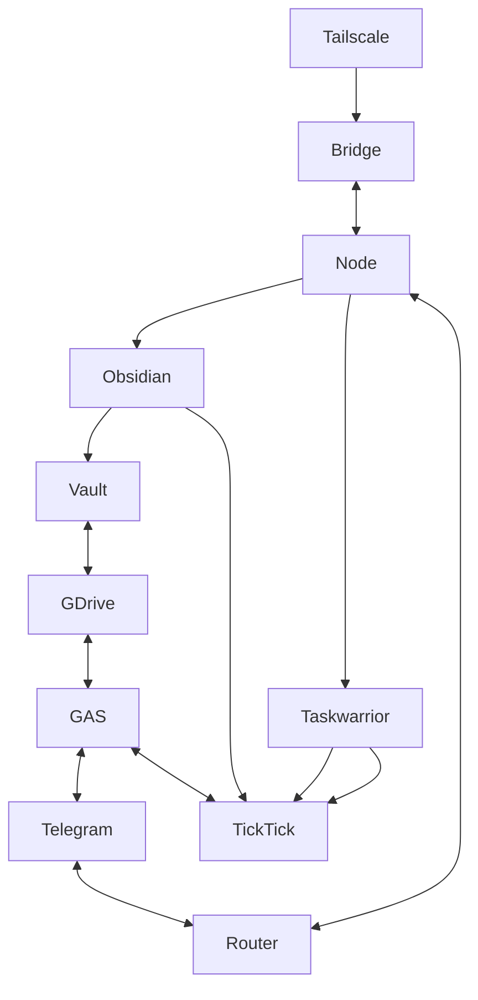

# AlphaOS Components Overview

Quick, human-readable map of what each subsystem does and where it lives.

## Core Components

- **Bridge** (`bridge/`)
  - aiohttp service on port 8080 (Core4/Fruits/Tent + task routing).
  - CLI helper: `bridgectl`.
  - Source of truth: `bridge/README.md`, `bridge/AGENTS.md`.

- **Router Bot** (`router/`)
  - Telegram dispatcher that routes commands to modules/URLs.
  - Uses `router/extensions/` and `config.yaml`.
  - Managed via `routerctl` + systemd user unit.
  - Source of truth: `router/README.md`, `router/AGENTS.md`.

- **GAS HQ** (`gas/`)
  - Single Apps Script project (HQ + inline centres).
  - Entry: `doGet()` in `gas/alphaos_single_project.gs`.
  - Source of truth: `gas/README.md`.

- **Node Index** (`index-node/`)
  - Local UI/Router on `http://127.0.0.1:8799`.
  - `menu.yaml` is the route/menu source.
  - Source of truth: `index-node/README.md`, `index-node/AGENTS.md`.

- **War Stack Bot** (`python-warstack-bot/`)
  - On-demand Telegram bot for War Stack creation.
  - `/resume` uses JSON in `WARSTACK_DATA_DIR`.
  - Source of truth: `python-warstack-bot/README.md`, `python-warstack-bot/AGENTS.md`.

- **Fire Map Bot** (`python-firemap-bot/`)
  - On-demand Taskwarrior snapshot sender.
  - Triggered via router `/fire` or run directly.
  - Source of truth: `python-firemap-bot/README.md`, `python-firemap-bot/AGENTS.md`.

## Data Flow (Current)

## Current Door Flow (TL;DR)

- Hot List → `Alpha_Door/1-Potential`
- Door War → `Alpha_Door/2-Plan`
- War Stack → `Alpha_Door/3-Production` (+ Telegram, + task queue)
- Hit List → `Alpha_Door/3-Production`
- Profit → `Alpha_Door/4-Profit` (MD + JSON)

## Cross-Links

- `DOCS/bridge_README.md` → `bridge/README.md`
- `DOCS/router_README.md` → `router/README.md`
- `DOCS/gas_README.md` → `gas/README.md`
- `DOCS/index-node_README.md` → `index-node/README.md`
- `DOCS/python-warstack-bot.md` → War Stack bot overview
- `DOCS/python-firemap-bot.md` → Fire Map bot overview
- `DOCS/node/taskwarrior.md` → Taskwarrior + bridge + node flow

## Centre Docs

- **GAS**: `DOCS/gas/` (Drive/Sheet/Script Props flows)
  - `DOCS/gas/door.md`
  - `DOCS/gas/voice.md`
  - `DOCS/gas/core4.md`
  - `DOCS/gas/fruits.md`
  - `DOCS/gas/game.md`
  - `DOCS/gas/frame.md`
  - `DOCS/gas/freedom.md`
  - `DOCS/gas/focus.md`
  - `DOCS/gas/fire.md`
  - `DOCS/gas/tent.md`
- **Node**: `DOCS/node/` (local vault + JSON + node API)
- **Taskwarrior**: `DOCS/node/taskwarrior.md`

## Scripts Docs

- `DOCS/scripts/README.md`
