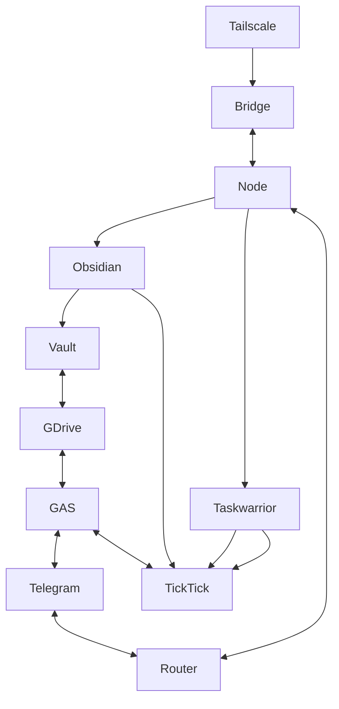

# AlphaOS Components Overview

Quick, human-readable map of what each subsystem does, what actually runs in production, and where to look next.

## Start Here

- **Centre index (URLs/storage/config):** `DOCS/centres.md`
- **GAS active surface (what runs, not legacy):** `DOCS/gas/functions-in-use.md`
- **Operational health checks:** `./hubctl doctor`, `./scripts/aos-doctor`, `./router/routerctl status`, `./bridge/bridgectl health`

## Quickstart (Local)

- **Index Node (local UI + API)**: `cd index-node && npm install && npm start` → `http://127.0.0.1:8799`
- **Bridge (aiohttp, task execution)**: `cd bridge && python app.py --host 0.0.0.0 --port 8080` → `http://127.0.0.1:8080/health`
- **Router bot (Telegram dispatcher)**: `cd router && pip install -r requirements.txt && python router_bot.py`

## Mental Model (1 minute)

- **GAS** is the cloud control plane: Google Drive/Sheets storage, Telegram webhook, TickTick integration, and the “HQ” WebApp.
- **Node** is the laptop plane: local UI + APIs (Taskwarrior, Vault files), driven by `index-node/menu.yaml`.
- **Bridge** connects cloud ↔ laptop: receives task operations, runs Taskwarrior locally, returns UUIDs back to GAS.
- **Router bot** is Telegram entry routing: directs `/door`, `/voice`, `/fire` etc. to the correct centres/URLs.

## Core Components

- **Bridge** (`bridge/`)
  - aiohttp service on port 8080 (Core4/Fruits/Tent + task routing).
  - CLI helper: `bridgectl`.
  - Source of truth: `bridge/README.md`, `bridge/AGENTS.md`.

- **Router Bot** (`router/`)
  - Telegram dispatcher that routes commands to modules/URLs.
  - Uses `router/extensions/` and `config.yaml`.
  - Managed via `routerctl` + systemd user unit.
  - Source of truth: `router/README.md`, `router/AGENTS.md`.

- **GAS HQ** (`gas/`)
  - Single Apps Script project (HQ + inline centres).
  - Entry: `doGet()` in `gas/alphaos_single_project.gs`.
  - Source of truth: `gas/README.md`.

- **Node Index** (`index-node/`)
  - Local UI/Router on `http://127.0.0.1:8799`.
  - `menu.yaml` is the route/menu source.
  - Source of truth: `index-node/README.md`, `index-node/AGENTS.md`.

- **AOS Centres (Desktop)** (`bin/aos-centres`)
  - Desktop entrypoint that opens Centres via `/cmd` routes.
  - Config: `aos-hub/config/aos-centres.env`.
  - Source of truth: `DOCS/aos-centres.md`.

- **War Stack Bot** (`python-warstack-bot/`)
  - On-demand Telegram bot for War Stack creation.
  - `/resume` uses JSON in `WARSTACK_DATA_DIR`.
  - Source of truth: `python-warstack-bot/README.md`, `python-warstack-bot/AGENTS.md`.

- **Fire Map Bot** (`python-firemap-bot/`)
  - Standalone module inside `aos-hub` (own setup + docs).
  - On-demand Taskwarrior snapshot sender.
  - Triggered via router `/fire` or run directly.
  - Source of truth: `python-firemap-bot/README.md`, `python-firemap-bot/AGENTS.md`.

## Data Flow (Current)

## Current Door Flow (Artifacts TL;DR)

- **Hot List (capture)** → `Alpha_Door/1-Potential`
  - Writes **1 Markdown file per idea** (Drive) + updates **`hotlist_index.json`** (dedupe + metadata).
  - Enqueues a Taskwarrior task op (via Bridge when online, otherwise queued in Script Props).
- **Door War (plan selection)** → uses Potential ideas + saves a **DoorWar Markdown** session via `saveDoorEntry(tool=DoorWar)`.
  - Drag/drop Q1/Q2 can move selected ideas **Potential → Plan** (`Alpha_Door/2-Plan`).
- **War Stack (weekly execution)** → `Alpha_Door/3-Production`
  - Saves **War Stack Markdown** via `saveDoorEntry(tool=WarStack)`; drafts autosave separately.
  - Builds task operations (Hits/Door/Profit) and queues them for Bridge execution; returned Taskwarrior UUIDs are written back into the War Stack markdown (`## Taskwarrior` + frontmatter keys).
- **Hit List (execution list)** → derived from War Stack hits; stored under `Alpha_Door/3-Production`.
- **Profit (review)** → `Alpha_Door/4-Profit`
  - Saves **Profit Markdown** + a **Profit JSON** snapshot (used for structured review / pipeline).

Details live in `DOCS/gas/door.md` and `DOCS/gas/door-hotlist.md`.

## Cross-Links

- `DOCS/bridge_README.md` → `bridge/README.md`
- `DOCS/router_README.md` → `router/README.md`
- `DOCS/gas_README.md` → `gas/README.md`
- `DOCS/index-node_README.md` → `index-node/README.md`
- `DOCS/aos-centres.md` → Desktop Centre integration
- `DOCS/centres.md` → Centre index (URLs/storage/config)
- `DOCS/python-warstack-bot.md` → War Stack bot overview
- `DOCS/python-firemap-bot.md` → Fire Map bot overview
- `DOCS/node/taskwarrior.md` → Taskwarrior + bridge + node flow

## Centre Docs

- **GAS**: `DOCS/gas/` (Drive/Sheet/Script Props flows)
  - `DOCS/gas/hq.md`
  - `DOCS/gas/door.md`
  - `DOCS/gas/voice.md`
  - `DOCS/gas/core4.md`
  - `DOCS/gas/game.md` (includes Frame/Freedom/Focus/Fire/Tent)
  - `DOCS/gas/fruits.md`
  - `DOCS/gas/functions-in-use.md` (active function surface; legacy detection)
- **Node**: `DOCS/node/` (local vault + JSON + node API)
- **Taskwarrior**: `DOCS/node/taskwarrior.md`

## Scripts Docs

- `DOCS/scripts/README.md`

## Debug / Triage (Fast)

- **GAS HQ**: open WebApp → run terminal commands `systemstatus`, `bridgecheck`, `stats`, `props`, `tasksync`.
- **Bridge**: `curl http://127.0.0.1:8080/health`
- **Index Node**: `curl http://127.0.0.1:8799/health`
- **Router**: `./router/routerctl status`

## Notes on Legacy

This repo contains older/experimental helpers. To avoid documenting dead code, treat the “active surface” as:
- functions reachable from `doGet/doPost`,
- functions called via `google.script.run.*`,
- and installed trigger handlers.

That list lives in `DOCS/gas/functions-in-use.md`.
